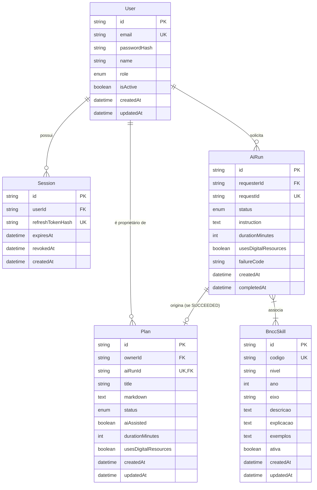

# Modelo de Dados e Esquema de Persistência: Planejador BNCC

**Feature**: `001-gerador-planos-bncc`  
**Data**: 2026-10-01  
**Status**: Concluído (Fase 1 - Revisado com docs/contracts/n8n.md)

Este documento descreve as entidades, relacionamentos, enumerações, índices e regras de integridade transacional do banco de dados PostgreSQL gerenciado via Prisma ORM em `apps/api/prisma/schema.prisma`.

---

## 1. Diagrama Entidade-Relacionamento (ERD)

---

## 2. Definição das Enumerações

### `Role`
- `PROFESSOR`: Docente com permissão para consultar catálogo e gerenciar exclusivamente seus próprios planos.
- `ADMIN`: Perfil administrativo (reservado para governança futura da plataforma; sem rotas nesta feature).

### `PlanStatus`
- `RASCUNHO`: Estado inicial e único editável nesta feature (Princípio IV da Constituição).
- `FINALIZADO`: Reservado para evolução futura do ciclo de vida.

### `AiRunStatus`
- `PENDING`: Solicitação encaminhada e aguardando processamento da IA.
- `SUCCEEDED`: Resposta válida recebida do n8n e plano RASCUNHO criado na mesma transação.
- `FAILED`: Falha na chamada (timeout de 60s, resposta inválida, 502/504); nenhum plano criado.

---

## 3. Especificação Detalhada das Tabelas

### 3.1 Tabela `User`
Representa os usuários docentes da plataforma.

| Campo | Tipo | Nulo | Descrição |
| :--- | :--- | :---: | :--- |
| `id` | UUID / String | Não | Chave primária única gerada via `uuid()`. |
| `email` | String | Não | E-mail corporativo único usado no login e como identificador de `sessao` no n8n (`@unique`). |
| `passwordHash` | String | Não | Hash seguro gerado por Argon2. |
| `name` | String | Não | Nome de exibição docente (ex.: "Ana Souza"). |
| `role` | `Role` | Não | Papel do usuário (default: `PROFESSOR`). |
| `isActive` | Boolean | Não | Flag indicando se a conta está habilitada (default: `true`). |
| `createdAt` | DateTime | Não | Carimbo de data/hora de criação (`default(now())`). |
| `updatedAt` | DateTime | Não | Carimbo de última modificação (`@updatedAt`). |

---

### 3.2 Tabela `Session` (Refresh Tokens)
Armazena os tokens de refresh para rotação de sessão com isolamento e revogação.

| Campo | Tipo | Nulo | Descrição |
| :--- | :--- | :---: | :--- |
| `id` | UUID / String | Não | Chave primária única. |
| `userId` | UUID / String | Não | Chave estrangeira referenciando `User.id` (`onDelete: Cascade`). |
| `refreshTokenHash` | String | Não | Hash SHA-256 do token criptográfico enviado via cookie HttpOnly. |
| `expiresAt` | DateTime | Não | Data de expiração da sessão (ex.: 7 dias a partir da emissão). |
| `revokedAt` | DateTime | Sim | Data em que a sessão foi revogada (logout ou rotação). |
| `createdAt` | DateTime | Não | Carimbo de data de início da sessão. |

**Índices**:
- `@@index([userId])`
- `@@unique([refreshTokenHash])`

---

### 3.3 Tabela `BnccSkill` (Catálogo BNCC)
Armazena o catálogo oficial da BNCC populado a partir de `data/bncc-recorte.json` em modo somente leitura para professores.

| Campo | Tipo | Nulo | Descrição |
| :--- | :--- | :---: | :--- |
| `id` | UUID / String | Não | Chave primária única. |
| `codigo` | String | Não | Código oficial da BNCC (`@unique`, ex.: `EF01CO01`). |
| `nivel` | String | Não | Nível de ensino (ex.: "Ensino Fundamental"). |
| `ano` | Int | Sim | Ano de ensino quando aplicável (ex.: 1, 2). |
| `eixo` | String | Não | Eixo temático curricular (ex.: "Pensamento Computacional (PC)"). |
| `descricao` | Text | Não | Descrição textual da competência. |
| `explicacao` | Text | Não | Orientações didáticas complementares da habilidade. |
| `exemplos` | Text | Não | Exemplos práticos de aplicação pedagógica em sala de aula. |
| `ativa` | Boolean | Não | Flag de ativação no catálogo (default: `true`). |
| `createdAt` | DateTime | Não | Carimbo de criação. |
| `updatedAt` | DateTime | Não | Carimbo de atualização. |

**Índices**:
- `@@index([ativa, codigo])`
- `@@index([eixo, ano])`

---

### 3.4 Tabela `AiRun`
Registra a rastreabilidade da orquestração de geração de plano assistida por IA.

| Campo | Tipo | Nulo | Descrição |
| :--- | :--- | :---: | :--- |
| `id` | UUID / String | Não | Chave primária única. |
| `requesterId` | UUID / String | Não | Chave estrangeira referenciando `User.id`. (O e-mail correspondente `User.email` é transmitido ao n8n no campo `sessao`). |
| `requestId` | String | Não | UUID v4 gerado pela API para rastreamento ponta a ponta (`@unique`). |
| `status` | `AiRunStatus` | Não | Status da execução (`PENDING`, `SUCCEEDED`, `FAILED`). |
| `instruction` | Text | Não | Instrução pedagógica preenchida pelo docente. |
| `durationMinutes` | Int | Não | Duração informada em minutos. |
| `usesDigitalResources` | Boolean | Não | Booleano indicando uso de recursos tecnológicos. |
| `failureCode` | String | Sim | Código de diagnóstico do erro (ex.: `TIMEOUT`, `SCHEMA_MISMATCH`, `SESSION_MISMATCH`, `N8N_502`). |
| `createdAt` | DateTime | Não | Data/hora do início da solicitação. |
| `completedAt` | DateTime | Sim | Data/hora de conclusão (sucesso ou falha). |

**Índices**:
- `@@index([requesterId, createdAt])`
- `@@index([status, createdAt])`

---

### 3.5 Tabela `Plan`
Armazena os rascunhos de planos de aula privados dos professores.

| Campo | Tipo | Nulo | Descrição |
| :--- | :--- | :---: | :--- |
| `id` | UUID / String | Não | Chave primária única. |
| `ownerId` | UUID / String | Não | Chave estrangeira referenciando `User.id` (`onDelete: Restrict`). |
| `aiRunId` | UUID / String | Não | Chave estrangeira única referenciando o `AiRun.id` de origem. |
| `title` | String | Não | Título da aula (ex.: "Sequências que organizam o cotidiano"). |
| `markdown` | Text | Não | Conteúdo pedagógico formatado em Markdown sanitizado. |
| `status` | `PlanStatus` | Não | Estado do plano (default: `RASCUNHO`). |
| `aiAssisted` | Boolean | Não | Flag indicando geração assistida por IA (default: `true`). |
| `durationMinutes` | Int | Não | Duração da aula em minutos. |
| `usesDigitalResources` | Boolean | Não | Indicador de uso de recursos digitais. |
| `createdAt` | DateTime | Não | Data/hora de criação do plano. |
| `updatedAt` | DateTime | Não | Data/hora da última edição salva pelo professor. |

**Índices**:
- `@@index([ownerId, status, updatedAt])`

---

## 4. Regras de Atomicidade e Integridade Transacional

1. **Geração com IA**:
   - O registro `AiRun` é criado antes do disparo externo com status `PENDING`.
   - Ao receber resposta válida e confirmada pelo schema do n8n com eco exato de `sessao == user.email`, a criação de `Plan` (status `RASCUNHO`) e a atualização de `AiRun` (status `SUCCEEDED`) são realizadas em **uma única transação atômica** (`prisma.$transaction`).
   - Se ocorrer timeout (60s), erro de transporte ou payload inválido, `AiRun` é atualizado para `FAILED` fora da transação de criação de planos, e **nenhum registro de `Plan` é criado**.
2. **Autorização e Isolamento (Multi-Tenant)**:
   - Toda query de leitura (`findFirst`), listagem (`findMany`) ou atualização (`update`) de planos inclui obrigatoriamente a cláusula `WHERE id = :planId AND ownerId = :authenticatedUserId`.
   - Se o plano pertencer a outro usuário ou não existir, o serviço lança exceção `NotFoundException` (HTTP 404), garantindo vazamento de metadados zero.
