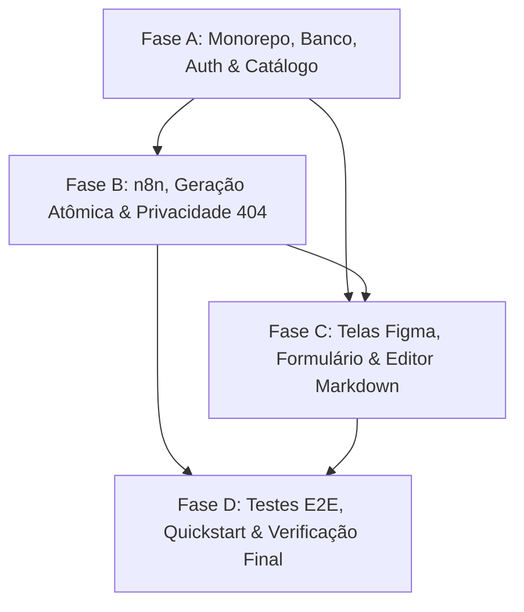

# Tasks: Planejador BNCC - Geração e Edição de Planos de Aula com IA

**Feature**: `001-gerador-planos-bncc` | **Branch**: `main`  
**Status**: Pronto para Execução  
**Documentos de Apoio**: [spec.md](./spec.md), [plan.md](./plan.md), [research.md](./research.md), [data-model.md](./data-model.md), [quickstart.md](./quickstart.md), [contracts/](./contracts/)

---

## Visão Geral das Fases

As tarefas estão estritamente organizadas por ordem de dependência nas quatro fases solicitadas:
- **Fase A**: Monorepo, scripts raiz, ambiente Docker, banco PostgreSQL, Prisma, autenticação com contas demo e catálogo BNCC.
- **Fase B**: Geração assistida, cliente n8n com contrato confirmado, validação de resposta, `AiRun` e privacidade de planos (404).
- **Fase C**: Telas do Figma (tokens CSS sem Tailwind, layout responsivo), estados (preparação, falha, sucesso), listagem e editor Markdown com preview sanitizado.
- **Fase D**: Testes automatizados (unitários, integração e E2E), documentação e validação ponta a ponta do quickstart.

---

## Fase A: Monorepo, Infraestrutura, Banco, Autenticação e Catálogo

**Objetivo**: Estabelecer a fundação de código do monorepo, banco PostgreSQL via Docker Compose, modelos Prisma, sementes idempotentes, autenticação com tokens JWT/cookies e consulta ao catálogo BNCC.

### Tarefas da Fase A

- [ ] T001 Inicializar estrutura do monorepo pnpm com workspaces (`apps/web`, `apps/api`), `pnpm-workspace.yaml`, `package.json` raiz com scripts (`dev`, `lint`, `typecheck`, `test`, `test:integration`, `build`) e pipeline do Turborepo em `turbo.json`.
- [ ] T002 Configurar serviço PostgreSQL 16 em `docker-compose.yml` com healthcheck `pg_isready -U postgres`, volume nomeado persistente e porta configurável.
- [ ] T003 [P] Configurar workspace `apps/api` (NestJS 11 + TypeScript estrito): criar `apps/api/package.json`, `apps/api/tsconfig.json`, `apps/api/tsconfig.build.json` e `apps/api/.env.example`.
- [ ] T004 [P] Configurar workspace `apps/web` (Next.js 15 App Router + TypeScript estrito): criar `apps/web/package.json`, `apps/web/tsconfig.json` e `apps/web/.env.example`.
- [ ] T005 Definir schema do banco de dados no Prisma com modelos `User`, `Session`, `BnccSkill`, `AiRun`, `Plan` e enums (`Role`, `PlanStatus`, `AiRunStatus`) em `apps/api/prisma/schema.prisma`.
- [ ] T006 Criar migração determinística inicial e gerar Prisma Client em `apps/api/prisma/migrations/`.
- [ ] T007 Implementar script de seed idempotente em `apps/api/prisma/seed.ts` para carregar o catálogo de `data/bncc-recorte.json` e criar as duas contas demo (`ana.souza@escola.gov.br` e `carlos.melo@escola.gov.br` com hash Argon2).
- [ ] T008 [P] Implementar módulo Prisma e serviço de conexão de banco de dados em `apps/api/src/common/prisma.service.ts`.
- [ ] T009 Implementar serviço de autenticação com validação de credenciais via Argon2 e emissão de Access Token JWT (15m) em `apps/api/src/auth/auth.service.ts` e DTOs em `apps/api/src/auth/dto/login.dto.ts`.
- [ ] T010 Implementar rotação de sessão com Refresh Token (7 dias) em cookie HttpOnly com hash SHA-256 persistido na tabela `Session` em `apps/api/src/auth/session.service.ts`.
- [ ] T011 Implementar controller de autenticação com endpoints `POST /login`, `POST /refresh`, `POST /logout` e `GET /me` em `apps/api/src/auth/auth.controller.ts`.
- [ ] T012 [P] Implementar Auth Guard JWT para proteção de rotas privadas e injeção do usuário autenticado no request em `apps/api/src/auth/jwt-auth.guard.ts`.
- [ ] T013 Implementar serviço de consulta do catálogo BNCC somente leitura com filtros por código, ano, nível, eixo e busca textual em `apps/api/src/bncc/bncc.service.ts`.
- [ ] T014 Implementar controller de catálogo `GET /api/v1/bncc/skills` com DTO de query params validados em `apps/api/src/bncc/bncc.controller.ts`.
- [ ] T015 [P] Implementar testes unitários e de integração de login, emissão de JWT, rotação de refresh token e logout em `apps/api/test/auth.spec.ts`.
- [ ] T016 [P] Implementar testes unitários e de integração de consulta e filtros do catálogo BNCC em `apps/api/test/bncc.spec.ts`.

**Critério de Conclusão da Fase A**: Contas de demonstração autenticam com emissão de token e cookie; catálogo BNCC responde com filtros; testes `auth.spec.ts` e `bncc.spec.ts` passam com 100% de sucesso.

---

## Fase B: Geração, Cliente n8n, Validação, AiRun e Privacidade de Planos

**Objetivo**: Implementar o cliente M2M de integração com o webhook do n8n (estritamente alinhado a `data/docs/contracts/n8n.md`), a orquestração transacional de `AiRun` e `Plan`, validação rigorosa de schema e o isolamento multi-tenant com resposta 404.

### Tarefas da Fase B

- [ ] T017 Implementar DTOs de entrada e validação com `class-validator` para solicitação de geração de plano em `apps/api/src/plans/dto/create-generation.dto.ts`.
- [ ] T018 Implementar cliente HTTPS `N8nClient` com cabeçalho `x-api-key: N8N_INTEGRATION_SECRET`, header de rastreamento `X-Request-Id: <UUIDv4>`, timeout de 60 segundos com `AbortController` e sem retry automático em `apps/api/src/plans/n8n.client.ts`.
- [ ] T019 Implementar modo mock local em `apps/api/src/plans/n8n-mock.service.ts` ativado por `N8N_MOCK_ENABLED=true` que ecoa `user.email` em `sessao`, retorna Markdown estruturado realista e suporta gatilhos de simulação de erro (`[SIMULAR_TIMEOUT]`, `[SIMULAR_ERRO]`).
- [ ] T020 Implementar validador de schema estrito da resposta do n8n em `apps/api/src/plans/n8n-validator.ts`, exigindo `success: true`, `format: "markdown"`, `answer` não-vazio e eco exato de `sessao == user.email`.
- [ ] T021 Implementar serviço de geração com atomicidade transacional em `apps/api/src/plans/plans.service.ts`: cria `AiRun` em `PENDING`; em sucesso grava `Plan` em `RASCUNHO` (`aiAssisted=true`) e marca `AiRun` em `SUCCEEDED` via `prisma.$transaction`; em falha marca `AiRun` como `FAILED` sem persistir plano parcial.
- [ ] T022 Implementar controle de privacidade e autorização estrita em `apps/api/src/plans/plans.service.ts`: consultas e edições filtram obrigatoriamente por `ownerId == user.id`; qualquer acesso a plano de outro professor lança `NotFoundException` (HTTP 404).
- [ ] T023 Implementar controller de planos com rotas `POST /generations`, `GET /`, `GET /:id` e `PATCH /:id` em `apps/api/src/plans/plans.controller.ts`, extraindo `user.id` e `user.email` diretamente do JWT.
- [ ] T024 [P] Implementar testes unitários do cliente n8n e validador de resposta (incluindo validação de eco de sessão) em `apps/api/test/n8n.client.spec.ts`.
- [ ] T025 [P] Implementar testes de integração da geração de plano com atomicidade transacional e cenários de falha (timeout e schema mismatch) em `apps/api/test/plans-generation.integration.spec.ts`.
- [ ] T026 [P] Implementar testes de privacidade garantindo que tentativa de leitura ou edição de planos de outro docente devolve 404 em `apps/api/test/plans-isolation.spec.ts`.

**Critério de Conclusão da Fase B**: Endpoint `POST /generations` funciona com mock local e com n8n real; falhas não geram planos parciais; isolamento devolve 404; testes de integração passam.

---

## Fase C: Telas Figma, Estados, Lista e Editor

**Objetivo**: Implementar o frontend no Next.js com Design Tokens puros do Figma (sem Tailwind), componentes reutilizáveis, formulário com os 4 frames, catálogo com chips, editor Markdown e modal de confirmação.

### Tarefas da Fase C

- [ ] T027 Configurar Design Tokens do Figma (`--ink`, `--muted`, `--line`, `--green`, `--green-dark`, `--canvas`, raios e tipografia) com CSS nativo e reset em `apps/web/app/styles.css`.
- [ ] T028 [P] Implementar componentes de UI reutilizáveis (`Button`, `Panel`, `Notice`, `Badge`, `EmptyState`) com foco em acessibilidade e estados visuais em `apps/web/components/ui/ui.tsx`.
- [ ] T029 [P] Implementar cliente HTTP de API com gerenciamento de Access Token em memória, renovação via cookie de refresh e tratamento de erros em `apps/web/lib/api-client.ts`.
- [ ] T030 Implementar tela de login com suporte às credenciais das contas de demonstração e redirecionamento pós-autenticação em `apps/web/app/login/page.tsx`.
- [ ] T031 Implementar layout base com Sidebar fidedigna ao Figma (navegação, marca, badge ambiente seguro e perfil docente ativo) e barra superior com breadcrumbs em `apps/web/app/layout.tsx`.
- [ ] T032 Implementar componente de consulta e seleção do catálogo BNCC em chips com busca textual por código/descrição em `apps/web/components/plans/bncc-catalog-selector.tsx`.
- [ ] T033 Implementar formulário de geração de planos (Frame `30:23234`) com layout em duas colunas responsivo (desktop, tablet e mobile) em `apps/web/app/planos/gerar/page.tsx` e `apps/web/components/plans/plan-form.tsx`.
- [ ] T034 Implementar transição visual e tela de estado de preparação (Frame `30:23541`) com bloqueio de reenvio duplo em `apps/web/components/plans/preparing-state.tsx`.
- [ ] T035 Implementar estado visual de falha na geração (Frame `30:24109`) com banner acessível (`role="alert"`), retenção dos campos e botão de reenvio manual em `apps/web/components/plans/generation-error-banner.tsx`.
- [ ] T036 Implementar página de listagem contendo exclusivamente os rascunhos criados pelo professor autenticado com indicador de auxílio por IA em `apps/web/app/planos/page.tsx`.
- [ ] T037 Implementar tela de revisão e edição do rascunho (Frame `30:23678`) com editor Markdown e aba de preview formatada sanitizada contra XSS em `apps/web/app/planos/[id]/page.tsx` e `apps/web/components/plans/plan-editor.tsx`.
- [ ] T038 Implementar modal acessível de confirmação contra perda de edições não salvas ao navegar ou fechar o rascunho em `apps/web/components/plans/unsaved-changes-modal.tsx`.
- [ ] T039 [P] Implementar testes de componentes de formulário, validação de campos e retenção de estado pós-erro em `apps/web/test/plan-form.spec.tsx`.
- [ ] T040 [P] Implementar testes do editor Markdown, sanitização de preview e modal de bloqueio em `apps/web/test/plan-editor.spec.tsx`.

**Critério de Conclusão da Fase C**: Todas as 4 telas do Figma renderizam com tokens CSS puros e responsividade; formulário preserva dados em erro; editor sanitiza Markdown e modal alerta sobre edições pendentes.

---

## Fase D: Testes, Documentação e Verificação Final

**Objetivo**: Executar a suíte de testes de integração e ponta a ponta, verificar o cumprimento da Constituição e validar os passos do quickstart.

### Tarefas da Fase D

- [ ] T041 Configurar ambiente de testes E2E com Playwright em `apps/web/playwright.config.ts` e configuração de testes de integração da API em `apps/api/vitest.integration.config.ts`.
- [ ] T042 [P] Implementar teste E2E da jornada completa do Professor 1 (Login -> Seleção de Habilidades -> Geração Mock -> Visualização de Rascunho -> Edição e Salvamento) em `apps/web/e2e/teacher-flow.spec.ts`.
- [ ] T043 [P] Implementar teste E2E de isolamento entre docentes (Professor 2 tenta acessar a URL do plano do Professor 1 e recebe 404) em `apps/web/e2e/isolation-404.spec.ts`.
- [ ] T044 Executar e validar todos os scripts unificados do monorepo na raiz (`pnpm lint`, `pnpm typecheck`, `pnpm test`, `pnpm test:integration`, `pnpm build`).
- [ ] T045 Executar e validar integralmente todos os cenários manuais descritos em `specs/001-gerador-planos-bncc/quickstart.md`.

**Critério de Conclusão da Fase D**: 100% dos testes unitários, de integração e E2E passam; scripts raiz executam sem erros; roteiro do `quickstart.md` validado com sucesso.

---

## Dependências e Ordem de Execução

### Grafo de Dependências entre Fases

### Oportunidades de Execução Paralela

- **Na Fase A**: T003 e T004 (configuração de workspaces) podem rodar em paralelo; T008 e T012 podem rodar em paralelo após o Prisma schema; T015 e T016 (testes) rodam em paralelo.
- **Na Fase B**: T024, T025 e T026 (testes de n8n, integração e isolamento 404) rodam em paralelo após a implementação dos serviços.
- **Na Fase C**: T028 e T029 podem rodar em paralelo após a definição dos tokens T027; T039 e T040 (testes de UI) rodam em paralelo.
- **Na Fase D**: T042 e T043 (testes E2E com Playwright) rodam em paralelo.

---

## Estratégia de Implementação (Entrega Incremental)

1. **Marco MVP (Fim da Fase A + B)**: API completa funcionando com banco PostgreSQL, login, catálogo BNCC, integração n8n com modo mock local e rotas de planos com garantia de 404.
2. **Marco Visual (Fim da Fase C)**: Telas do Figma conectadas à API com responsividade, formulário com estados de carregamento e erro, e editor Markdown sanitizado.
3. **Marco Final de Produção (Fase D)**: Testes E2E cobrindo todas as 5 histórias de usuário, build determinístico e validação completa do quickstart.
